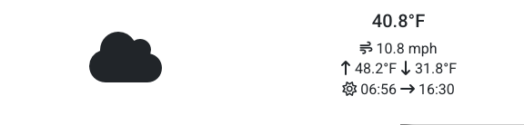

<h1 align="center">Welcome to ThermalPrinter 👋</h1>
<p>
  <a href="https://github.com/onemec/ThermalPrinter/wiki" target="_blank">
    
  </a>
  <a href="https://spdx.org/licenses/GPL-3.0-only.html" target="_blank">
    
  </a>
</p>

> Enables printing simple web content (news, puzzles, etc.) to any ESC/POS thermal printer.

## Pre-requisites
- Install [uv](https://docs.astral.sh/uv/getting-started/installation/)
- Install Chromium within [playwright](https://playwright.dev/docs/intro#installing-playwright) with `uv run playwright install chromium`

## Usage

```sh
uv run src/main.py --help
```

### Basic Usage

Print content to your thermal printer:

```sh
uv run src/main.py sudoku weather
```

### Dry Run Mode

Generate output files (HTML and PNG) without sending to the printer:

```sh
uv run src/main.py --dry-run sudoku
```

This creates `temp.html` and `temp.png` files that you can preview before printing.

### Example Outputs

Here are examples of what the thermal printer output looks like:

#### Sudoku Puzzle


#### Weather Report


### Printer Configuration

By default, the printer uses vendor ID `0x1fc9` and product ID `0x2016`. To use a different printer, specify the IDs:

```sh
uv run src/main.py --vendor-id 0x1234 --product-id 0x5678 sudoku
```

#### Finding Your Printer's IDs

Follow the guide [here](https://python-escpos.readthedocs.io/en/latest/user/usage.html#usb-printer).

## Testing

```sh
uv run pytest
```


## 🤝 Contributing

Contributions, issues and feature requests are welcome!<br />Feel free to check [issues page](https://github.com/onemec/ThermalPrinter/issues).
